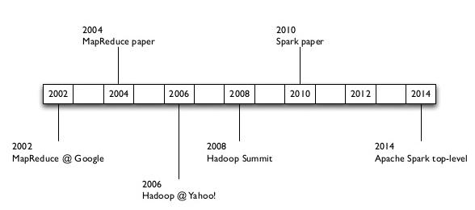
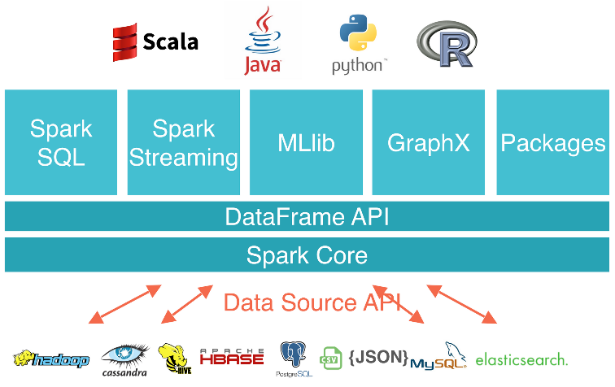
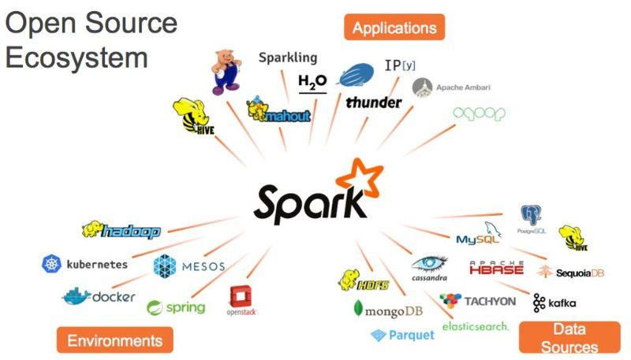
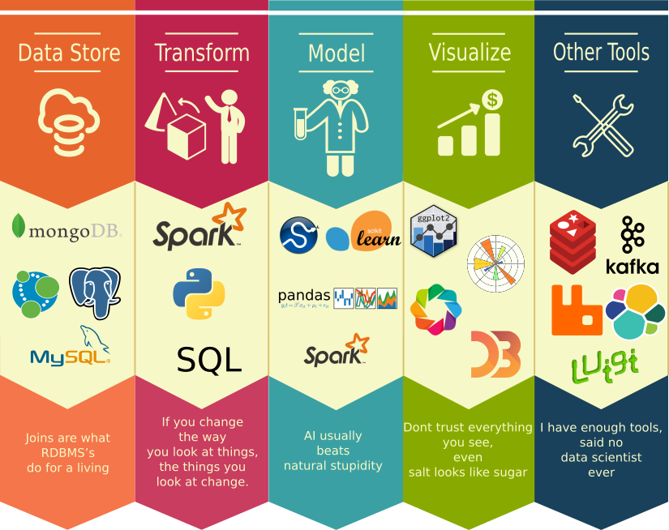
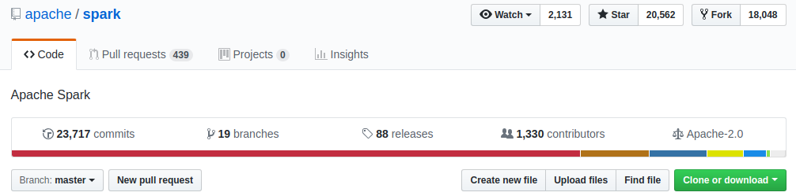
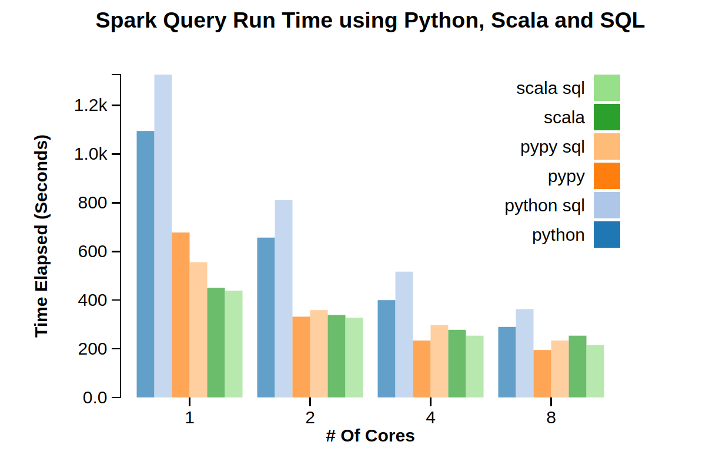
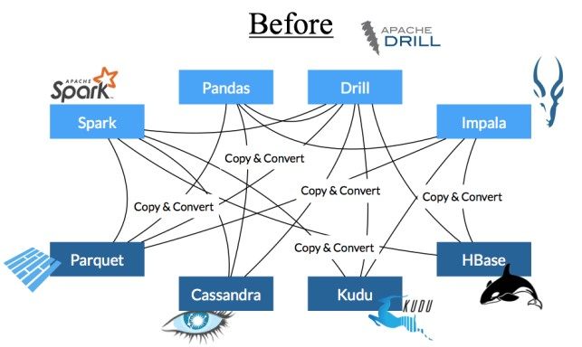
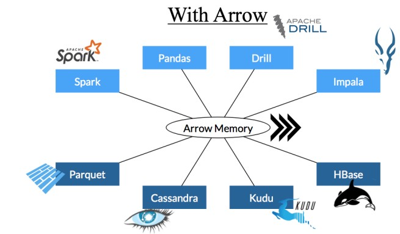

---
presentation:
  # See https://shd101wyy.github.io/markdown-preview-enhanced/#/presentation

  # presentation theme
  theme: blood.css

  # The "normal" size of the presentation, aspect ratio will be preserved
  width: 1600
  height: 900

  # Factor of the display size that should remain empty around the content
  margin: 0.05

  # Display a presentation progress bar
  progress: true

  # Enable keyboard shortcuts for navigation
  keyboard: true

  # Number of milliseconds between automatically proceeding to the
  # next slide, disabled when set to 0, this value can be overwritten
  # by using a data-autoslide attribute on your slides
  autoSlide: 0

  # Vertical centering of slides
  center: false

  # Stop auto-sliding after user input
  autoSlideStoppable: true

  # Loop the presentation
  loop: false

  # Enable Speake Notes
  enableSpeakerNotes: true

  # Number of slides away from the current that are visible
  viewDistance: 3

---

<!-- slide data-background-image=imgs/background1.jpg -->

## Python and Spark for Data Science
------------------------------------------
### Leandro Ferrado, Martín Pellarolo

#### February 13th, 2019

<!-- slide  data-background-image=imgs/background2.jpg-->

## Week 1 - Introduction
-------------------------------------

### Agenda
-------------------------------------
##### - Course Information
##### - Introduction to Spark
##### - Spark + Python = PySpark
##### - Python 101
##### - Setup Environment
-------------------------------------

<!-- slide  data-background-image=imgs/background2.jpg align=left -->

## 
 Course Information 

-------------------------------------

##### Classes
Wed & Fri 2:30PM to 3:30PM UTC-3

##### Lecturers  
- Leandro Ferrado (https://github.com/leferrad)
- Martín Pellarolo (https://github.com/martinpella)

**Github repo:** https://github.com/leferrad/course-spark-ds

-----------------------------
> **Goal:** Learn essential tools to manipulate data of any size, that allows to start doing Data Science.

-----------------------------

> ### Scope
>- Use of PySpark
>- RDD operations
>- DataFrame API
>- Pandas UDF
>- Basic configuration
>- Build data pipelines

<!-- slide  data-background-image=imgs/background2.jpg-->

## Apache Spark - Introduction
-------------------------------------

- Cluster computing platform for large-scale data processing.
- Designed to be *fast* and *general purpose*.
- Check it on the [website](http://spark.apache.org/)

<!-- slide  data-background-image=imgs/background2.jpg-->

## Brief History of Spark
-------------------------------------

<!-- slide  data-background-image=imgs/background2.jpg-->

## Spark Stack
-------------------------------------

<!-- slide  data-background-image=imgs/background2.jpg-->

## Spark Architecture
-------------------------------------

<!-- slide  data-background-image=imgs/background2.jpg-->

## Spark Ecosystem
-------------------------------------

<!-- slide  data-background-image=imgs/background2.jpg-->

## Spark and Data Science Stack
-------------------------------------

<!-- slide  data-background-image=imgs/background2.jpg-->

## Spark Releases
-------------------------------------

> Differences between 1.x and 2.x

> Check it on [Github](https://github.com/apache/spark)

<!-- slide  data-background-image=imgs/background2.jpg-->

## Python + Spark = PySpark
-------------------------------------

API Documentation: http://spark.apache.org/docs/latest/api/python

<!-- slide  data-background-image=imgs/background2.jpg-->

## Python - JVM
-------------------------------------

<!-- slide  data-background-image=imgs/background2.jpg-->

## Spark and Arrow
-------------------------------------

<!-- slide  data-background-image=imgs/background2.jpg-->

## Spark and Arrow
-------------------------------------

<!-- slide  data-background-image=imgs/background2.jpg-->

## Python libraries
-------------------------------------

> Check the notebooks on https://github.com/leferrad/course-spark-ds/tree/master/notebooks/w1_introduction and practice!

<!-- slide  data-background-image=imgs/background2.jpg-->

## Setup Environment
-------------------------------------

> You can find a guide to achieve a correct setup of the environment in [README.md](https://github.com/leferrad/course-spark-ds/blob/master/README.md).
