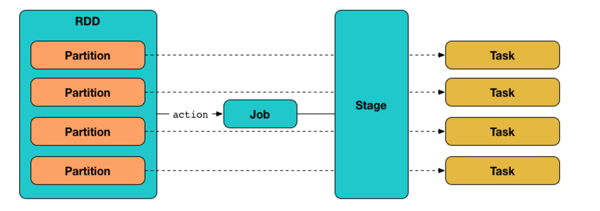
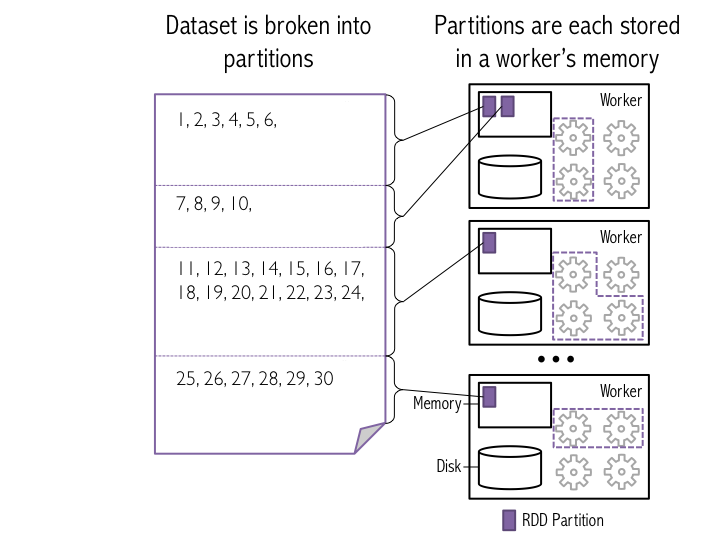
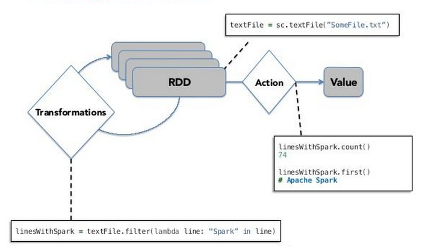
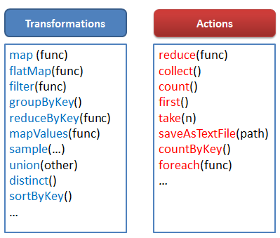
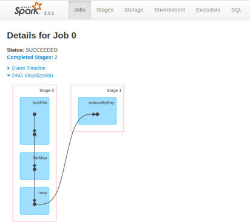
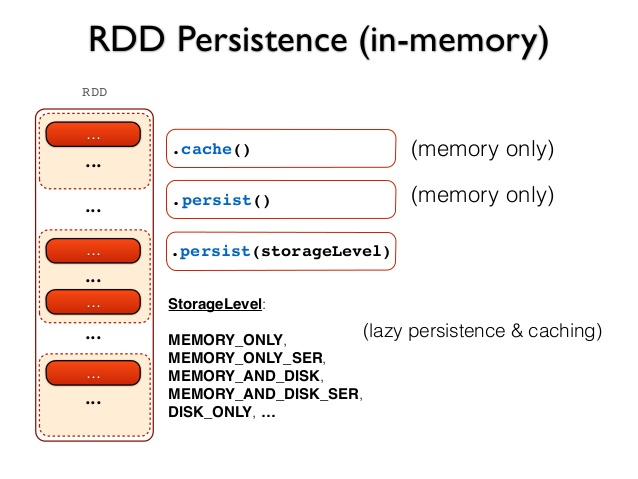

---
presentation:
  # See https://shd101wyy.github.io/markdown-preview-enhanced/#/presentation

  # presentation theme
  theme: blood.css

  # The "normal" size of the presentation, aspect ratio will be preserved
  width: 1600
  height: 900

  # Factor of the display size that should remain empty around the content
  margin: 0.05

  # Display a presentation progress bar
  progress: true

  # Enable keyboard shortcuts for navigation
  keyboard: true

  # Number of milliseconds between automatically proceeding to the
  # next slide, disabled when set to 0, this value can be overwritten
  # by using a data-autoslide attribute on your slides
  autoSlide: 0

  # Vertical centering of slides
  center: false

  # Stop auto-sliding after user input
  autoSlideStoppable: true

  # Loop the presentation
  loop: false

  # Enable Speake Notes
  enableSpeakerNotes: true

  # Number of slides away from the current that are visible
  viewDistance: 3

---

<!-- slide data-background-image=imgs/background1.jpg -->

## Python and Spark for Data Science
------------------------------------------
### Leandro Ferrado, Martín Pellarolo

#### February 20th, 2019

<!-- slide  data-background-image=imgs/background2.jpg-->

## Week 1 - Introduction
-------------------------------------

### Agenda
-------------------------------------
##### - Resilient Distributed Datasets (RDD)
##### - RDD operations
##### - RDD properties
##### - Functional Programming
-------------------------------------

<!-- slide  data-background-image=imgs/background2.jpg-->

## Resilient Distributed Datasets (RDD)
-------------------------------------

- RDD is simply a immutable distributed collection of elements.
  - In Spark all work is expressed as operations on RDDs to compute a result.
  - Under the hood, Spark automatically distributes the data contained in RDDs across your cluster and parallelizes the operations you perform on them

<!-- slide  data-background-image=imgs/background2.jpg-->

## Resilient Distributed Datasets (RDD)
-------------------------------------

- Each RDD is split into multiple *partitions*, which may be computed on different nodes of the cluster.

<!-- slide  data-background-image=imgs/background2.jpg-->

## RDD Operations
-------------------------------------

There are 2 valid operations:
- **Transformations: RDD -> RDD**
  - Lazy Evaluation
  - e.g. map, filter
- **Actions: RDD -> Value**
  - Execute DAG of opeations
  - e.g. count, sum, collect,

<!-- slide  data-background-image=imgs/background2.jpg-->

## RDD Operations
-------------------------------------

<!-- slide  data-background-image=imgs/background2.jpg-->

## RDD Operations
-------------------------------------

<!-- slide  data-background-image=imgs/background2.jpg-->

## RDD DAG
-------------------------------------

<!-- slide  data-background-image=imgs/background2.jpg-->

## RDD Cache
-------------------------------------

