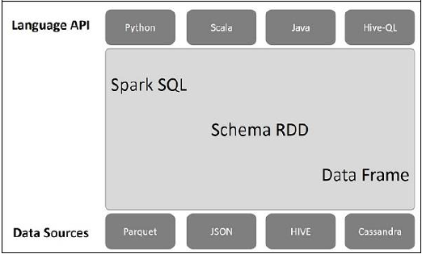
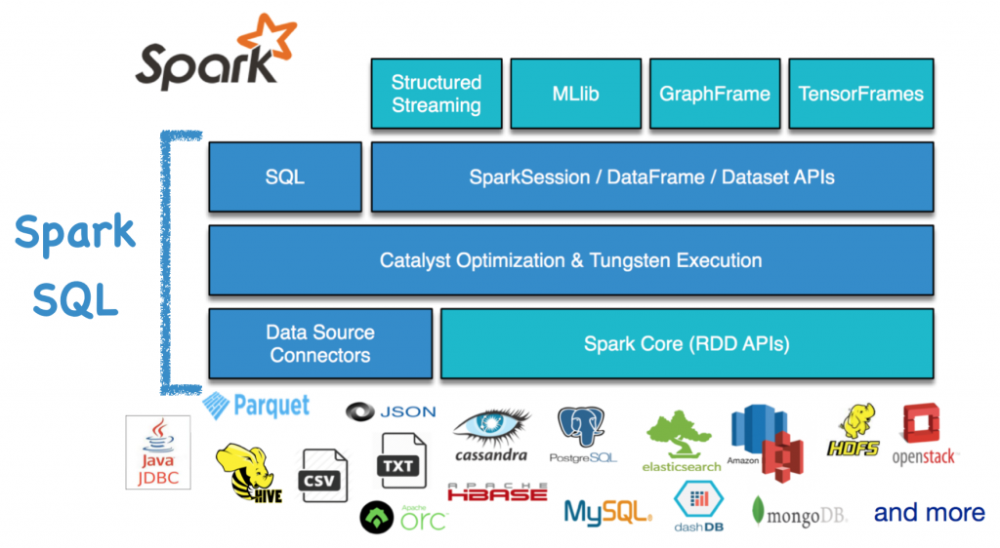
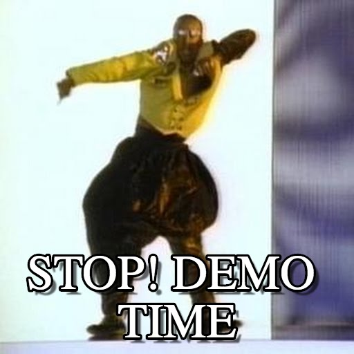
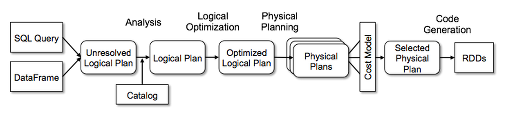

---
presentation:
  # See https://shd101wyy.github.io/markdown-preview-enhanced/#/presentation

  # presentation theme
  theme: blood.css

  # The "normal" size of the presentation, aspect ratio will be preserved
  width: 1600
  height: 900

  # Factor of the display size that should remain empty around the content
  margin: 0.05

  # Display a presentation progress bar
  progress: true

  # Enable keyboard shortcuts for navigation
  keyboard: true

  # Number of milliseconds between automatically proceeding to the
  # next slide, disabled when set to 0, this value can be overwritten
  # by using a data-autoslide attribute on your slides
  autoSlide: 0

  # Vertical centering of slides
  center: false

  # Stop auto-sliding after user input
  autoSlideStoppable: true

  # Loop the presentation
  loop: false

  # Enable Speake Notes
  enableSpeakerNotes: true

  # Number of slides away from the current that are visible
  viewDistance: 3

---

<!-- slide data-background-image=imgs/background1.jpg -->

## Python and Spark for Data Science
------------------------------------------
### Leandro Ferrado, Martín Pellarolo


#### February 27th, 2019


<!-- slide  data-background-image=imgs/background2.jpg-->

## Week 1 - Introduction
-------------------------------------

### Agenda
-------------------------------------
##### - Spark SQL
##### - DataFrame vs RDD
##### - Data Sources
##### - DataFrame operations
##### - Spark UDFs

-------------------------------------

<!-- slide  data-background-image=imgs/background2.jpg-->

## Spark SQL
-------------------------------------



- **DataFrame = RDD + Schema + SQL methods**
- Se proveen distintos conectores a data sources (además de 3rd parties)
- Se puede interactuar con DFs con distintas APIs.


<!-- slide  data-background-image=imgs/background2.jpg-->

## DataFrame vs RDD
-------------------------------------


<!-- slide  data-background-image=imgs/background2.jpg-->

## Data Sources
-------------------------------------



<!-- slide  data-background-image=imgs/background2.jpg-->

## DataFrame Operations
-------------------------------------




<!-- slide  data-background-image=imgs/background2.jpg align=left-->

## Spark UDFs (vectorized)
-------------------------------------

> ### **Steps:**

> #### 1. Register UDF to use in SQL
> #### 2. Use UDF over DF

> ##### Example

```python
from pyspark.sql.types import StringType
from pyspark.sql.functions import udf

maturity_udf = udf(lambda age: "adult" if age >=18 else "child", StringType())

df = sqlContext.createDataFrame([{'name': 'Alice', 'age': 1}])
df.withColumn("maturity", maturity_udf(df.age))
```


<!-- slide  data-background-image=imgs/background2.jpg-->

## [EXTRA] Catalyst optimization
-------------------------------------



> Link: https://databricks.com/blog/2015/04/13/deep-dive-into-spark-sqls-catalyst-optimizer.html
