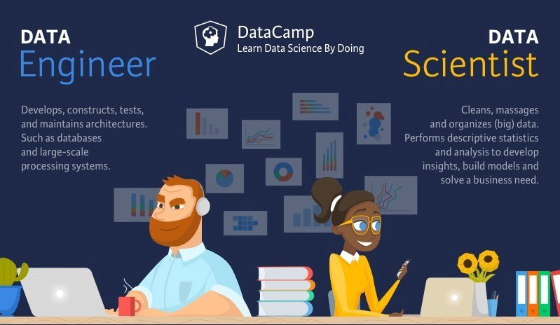
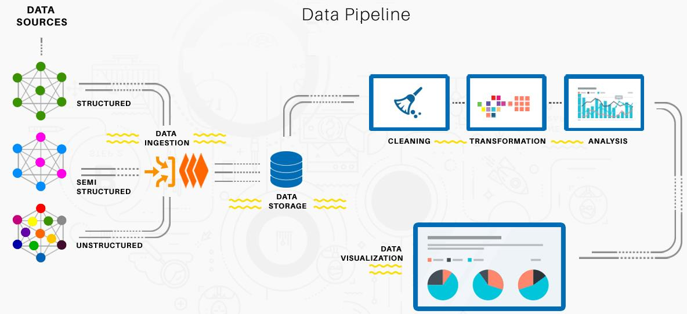
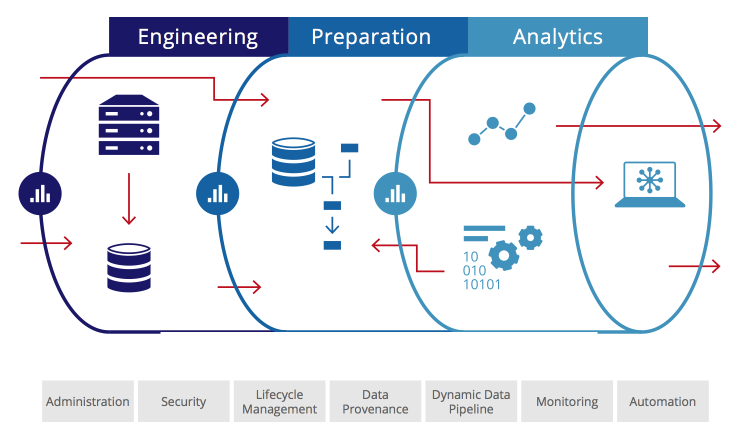
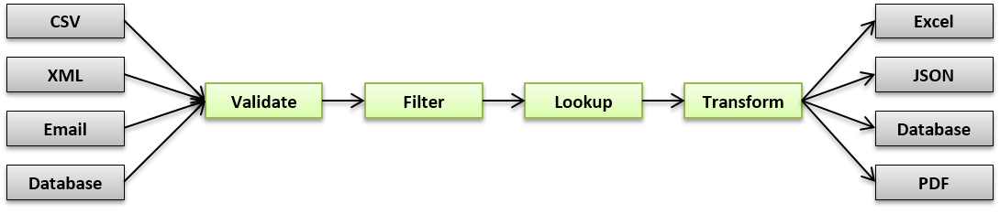
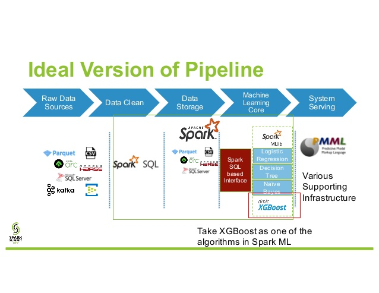

---
presentation:
  # See https://shd101wyy.github.io/markdown-preview-enhanced/#/presentation

  # presentation theme
  theme: blood.css

  # The "normal" size of the presentation, aspect ratio will be preserved
  width: 1600
  height: 900

  # Factor of the display size that should remain empty around the content
  margin: 0.05

  # Display a presentation progress bar
  progress: true

  # Enable keyboard shortcuts for navigation
  keyboard: true

  # Number of milliseconds between automatically proceeding to the
  # next slide, disabled when set to 0, this value can be overwritten
  # by using a data-autoslide attribute on your slides
  autoSlide: 0

  # Vertical centering of slides
  center: false

  # Stop auto-sliding after user input
  autoSlideStoppable: true

  # Loop the presentation
  loop: false

  # Enable Speake Notes
  enableSpeakerNotes: true

  # Number of slides away from the current that are visible
  viewDistance: 3

---

<!-- slide data-background-image=imgs/background1.jpg -->

## Python and Spark for Data Science
------------------------------------------
### Leandro Ferrado, Martín Pellarolo

#### March 14th, 2019

<!-- slide  data-background-image=imgs/background2.jpg-->

## Week 4 - Data Pipelines
-------------------------------------

### Agenda
-------------------------------------
##### - Data Engineering
##### - Pipeline Steps
##### - Spark SQL operations
##### - Spark UDFs in pipelines
##### - [EXTRA] Spark ML Pipelines

-------------------------------------

<!-- slide  data-background-image=imgs/background2.jpg-->

## Data Engineering
-------------------------------------

<!-- slide  data-background-image=imgs/background2.jpg-->

## Data Engineering Tasks
-------------------------------------

<!-- slide  data-background-image=imgs/background2.jpg-->

## Data Pipelines Steps
-------------------------------------

<!-- slide  data-background-image=imgs/background2.jpg-->

## Data Pipeline Example
-------------------------------------

<!-- slide  data-background-image=imgs/background2.jpg-->

## Data Pipeline Example
-------------------------------------

<!-- slide  data-background-image=imgs/background2.jpg-->

## Spark SQL Operations
-------------------------------------

<!-- slide  data-background-image=imgs/background2.jpg-->

## [EXTRA] Spark ML Pipelines
-------------------------------------

> Link: http://spark.apache.org/docs/latest/ml-pipeline.html
